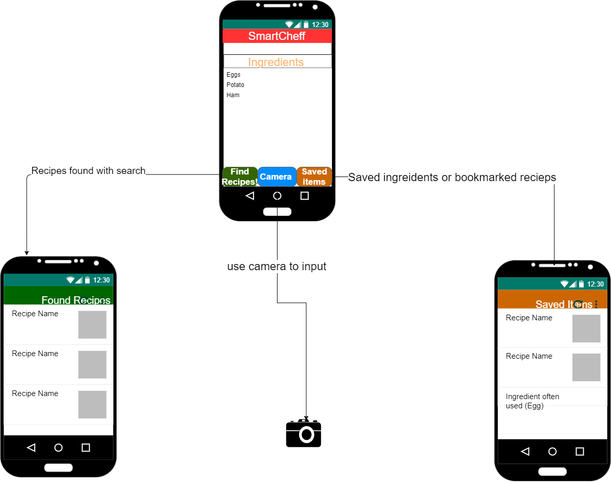

## Summary

SmartCheff is an app that allows the user to input any amount 
of ingredients. The user is then presented recipes that include those ingredients.
Picture being a student with the classic ingredient Top Ramen. When Top Ramen is selected as 
an ingredient SmartCheff will display all the delicious ways to cook your Top Ramen.

## Intended users
 * low-income user: 
 > As a low-income user with a limited budget I want to use SmartCheff because it allows me to input ingredients I have on hand and be presented with a list of new ways to combine and cook meals with those ingredients. 
 * professional Chef
 > As a professional chef I use SmartCheff because When I input any number of ingredients I am presented with a lot of different ways to combine and cook those ingredients.  
 * A beginner cook:
 > As a beginner cook, I use SmartCheff because I have little to no experience cooking. SmartCheff allows me to input the ingredients I have and quickly find recipes as a resource I can use to increase my experience and knowledge of cooking.
 
## Functionality
 * Recipe lookup: When a user inputs the ingredients, the app will generate a list of recipes that include the selected ingredients.
 * The use of the users' camera: The camera will be used to input products as an ingredient by scanning the barcode of a product.
 * Ability to bookmark recipes or save recipe location.

## Persistent data
 * Users' most-used ingredients.
 * User bookmarked recipes.
 * User most used recipes.
 
## Device/external services
* Users camera: The camera will be used to input products as an ingredient by scanning the barcode of a product.
  * <https://developer.android.com/reference/android/hardware/Camera>
   * This app will be able to function with out the camera but will not be able to input products as ingredients useing a barcode.
   
* <https://rapidapi.com/jonata/api/barcode-monster/endpoints>
 * This web service will allow the app to look up a product useing a upc barcode so i can then input the product as an ingredient.
  * This app will be able to function with out this service but the camera input of an ingredient will not.
 
* <https://spoonacular.com/food-api/docs>
 * This web service will allow the app to use the inputed ingredients for a search of recipes.
  * The app will not function with out this service.

## Stretch goals/possible enhancements 
* Ability to control smart devices in the home.
Example: Preheat smart oven

## Wireframe diagram
 